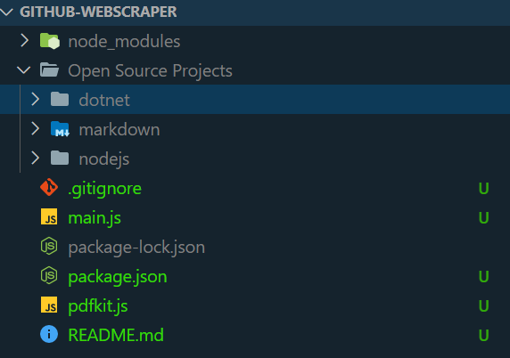
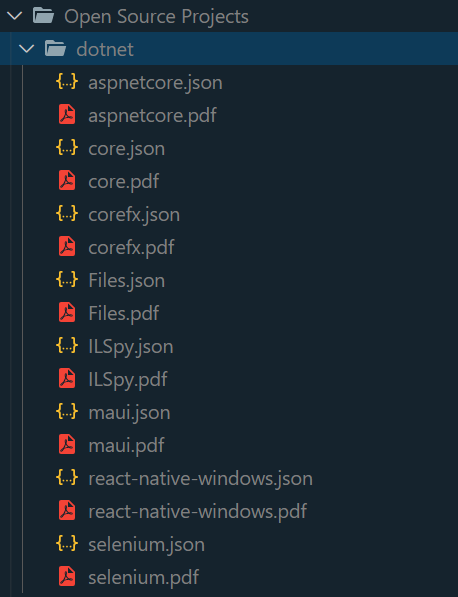
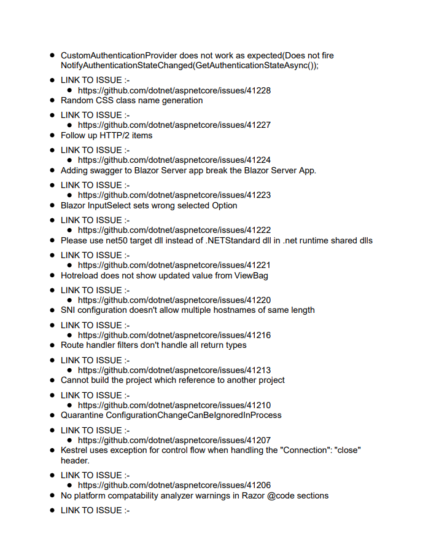

# Github Web Scraper

It scraps issues and their links of top 8 Repositories of an Open Source Project 
which can be found in the https://github.com/topics webpage.
Finally the scraped data is stored in a json file and then converted
to pdf document
 having issues name and their links for better readability.

## Tech Stack
Node.js

## Screenshots

